# INFORME - LABORATORIO 5.2  
# Configuración de un Pipeline de Despliegue Continuo con Docker 🐳

---

## Datos del Estudiante

| Campo | Información |
|---|---|
| Nombre | Diego Santiago Solorzano Arancibia |
| Carrera | Ing. en Ciencias de la Computación |
| Materia | Trabajando en la Nube |
| Fecha | 13/05/2026 |

---

# 1. Introducción

En este laboratorio se implementó un pipeline completo de Integración y Despliegue Continuo (CI/CD) utilizando Docker, GitHub Actions y un servidor remoto EC2.

El objetivo principal fue automatizar el proceso de construcción, publicación y despliegue de una aplicación contenerizada, aplicando buenas prácticas de DevOps como:

- Uso de imágenes Docker optimizadas.
- Automatización mediante GitHub Actions.
- Gestión segura de secretos.
- Validación mediante health checks.
- Rollback a versiones anteriores.

---

# 2. Objetivos Cumplidos

Durante el desarrollo del laboratorio se logró:

- Comprender el flujo completo de CI/CD con Docker.
- Crear un Dockerfile utilizando multi-stage build.
- Automatizar el build y push de imágenes Docker.
- Automatizar el despliegue en una instancia EC2.
- Gestionar secretos mediante GitHub Secrets.
- Implementar health checks para despliegues seguros.
- Aplicar versionamiento de imágenes mediante SHA.
- Comprender el proceso de rollback.

---

# 3. Desarrollo del Laboratorio

---

# 3.1 Creación del Dockerfile

Se creó un archivo `Dockerfile` utilizando múltiples etapas para optimizar el tamaño final de la imagen.

## Dockerfile Implementado

```dockerfile
# Etapa 1: Build (Construcción)
FROM node:20-alpine AS builder
WORKDIR /app
COPY package*.json ./

# Instalamos solo dependencias de producción
RUN npm ci --only=production

COPY . .

# Etapa 2: Runtime (Imagen final ligera)
FROM node:20-alpine

WORKDIR /app

COPY --from=builder /app/node_modules ./node_modules
COPY --from=builder /app/package*.json ./
COPY --from=builder /app/app.js ./
COPY --from=builder /app/server.js ./

EXPOSE 3000

CMD ["node", "server.js"]
```

## Explicación

El uso de multi-stage build permite:

- Reducir el tamaño de la imagen final.
- Eliminar dependencias innecesarias.
- Mejorar la seguridad del contenedor.
- Optimizar tiempos de despliegue.

## Evidencia

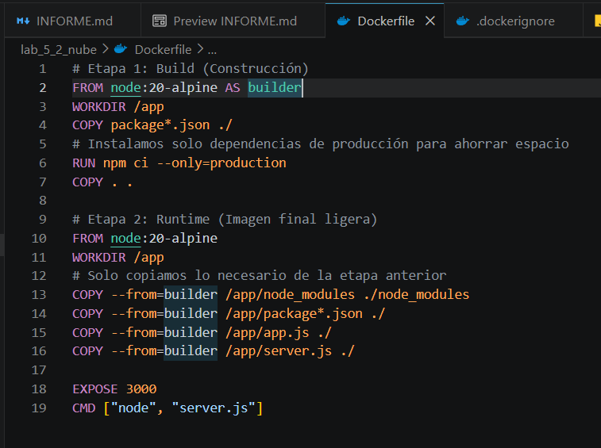

---

# 3.2 Archivo .dockerignore

Se creó el archivo `.dockerignore` para evitar copiar archivos innecesarios al contexto de build.

## Contenido del archivo

```text
node_modules
npm-debug.log
.git
.github
.env
Dockerfile
.dockerignore
```

## Beneficios

- Reduce el tamaño del contexto Docker.
- Mejora la velocidad del build.
- Evita incluir archivos sensibles.

## Evidencia

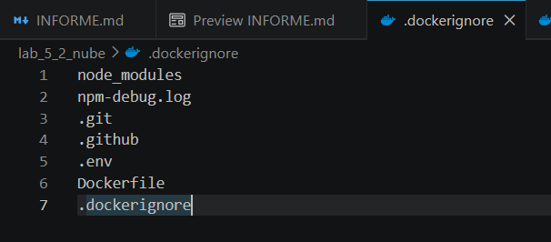

---

# 3.3 Construcción y prueba local

## Construcción de la imagen

```bash
docker build -t mi-app:local .
```

## Evidencia

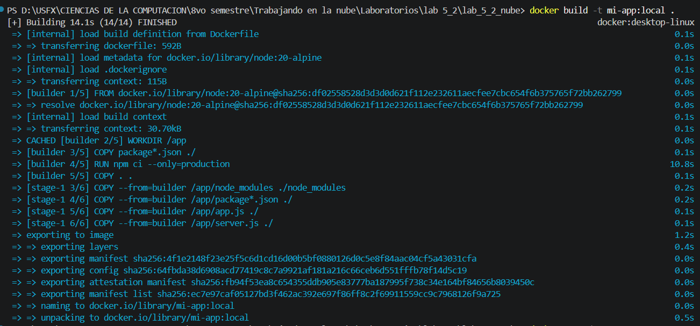
---

## Ejecución del contenedor

```bash
docker run -d -p 3000:3000 --name app-local mi-app:local
```

## Evidencia

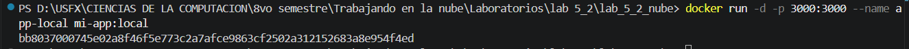
---

## Verificación del endpoint health

```bash
curl http://localhost:3000/health
```

## Resultado esperado

```json
{
  "status": "ok"
}
```

## Evidencia

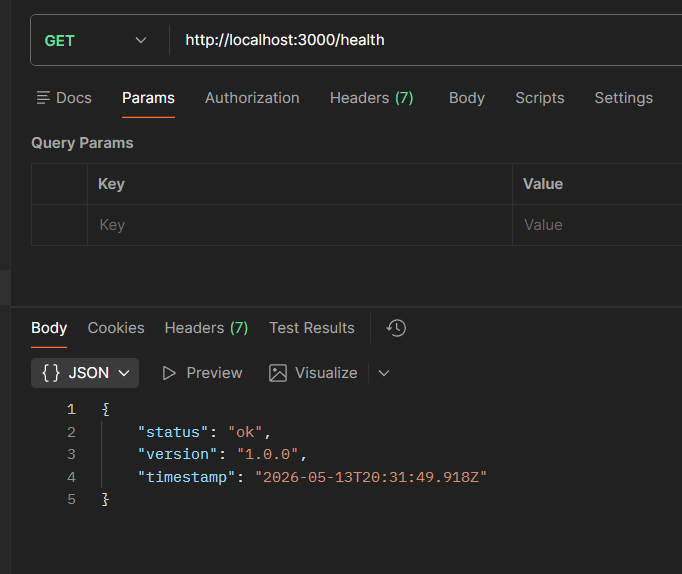

---

## Eliminación del contenedor

```bash
docker stop app-local; docker rm app-local
```

## Evidencia

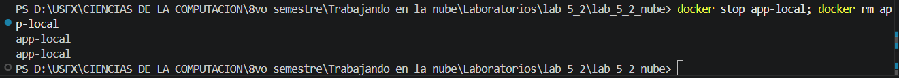

---

# 3.4 Configuración de Secretos en GitHub

Se configuraron secretos dentro del repositorio para proteger información sensible.

## Secretos configurados

| Nombre | Descripción |
|---|---|
| DOCKER_USERNAME | Usuario de Docker Hub |
| DOCKER_PASSWORD | Access Token de Docker Hub |
| SSH_HOST | IP pública de EC2 |
| SSH_USER | Usuario SSH |
| SSH_PRIVATE_KEY | Llave privada SSH |

## Variable configurada

| Variable | Valor |
|---|---|
| IMAGE_NAME | usuario/mi-app |

## Evidencia

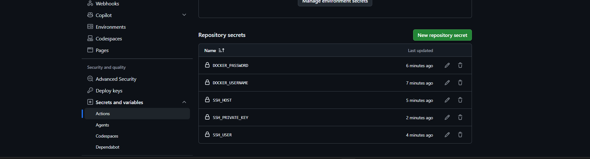
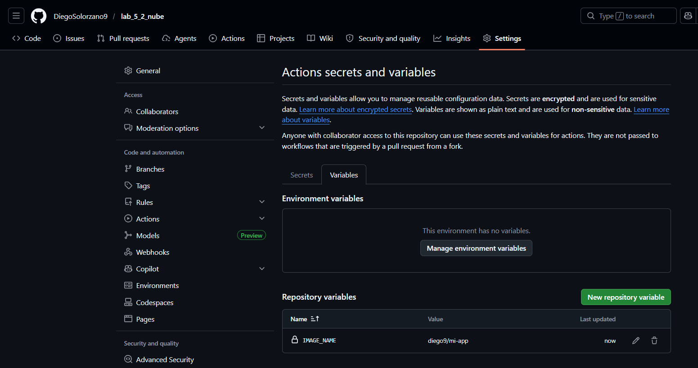

---

# 3.5 Configuración del Workflow CD

Se creó el workflow `.github/workflows/cd.yml`.

## Workflow Implementado

```yaml
name: CD - Build, Push and Deploy

on:
  push:
    branches: [main]

jobs:
  build-and-push:
    runs-on: ubuntu-latest
    steps:
      - name: Checkout del codigo
        uses: actions/checkout@v4

      - name: Login a Docker Hub
        uses: docker/login-action@v3
        with:
          username: ${{ secrets.DOCKER_USERNAME }}
          password: ${{ secrets.DOCKER_PASSWORD }}

      - name: Build y Push de la imagen
        uses: docker/build-push-action@v5
        with:
          context: .
          push: true
          tags: |
            ${{ secrets.DOCKER_USERNAME }}/mi-app:${{ github.sha }}
            ${{ secrets.DOCKER_USERNAME }}/mi-app:latest

      - name: Escaneo de vulnerabilidades (Trivy)
        uses: aquasecurity/trivy-action@master
        with:
          image-ref: ${{ secrets.DOCKER_USERNAME }}/mi-app:${{ github.sha }}
          format: 'table'
          severity: 'CRITICAL,HIGH'

  deploy:
    needs: build-and-push
    runs-on: ubuntu-latest
    steps:
      - name: Deploy remoto via SSH
        uses: appleboy/ssh-action@v1.0.0
        with:
          host: ${{ secrets.SSH_HOST }}
          username: ${{ secrets.SSH_USER }}
          key: ${{ secrets.SSH_PRIVATE_KEY }}
          script: |
            IMAGE="${{ secrets.DOCKER_USERNAME }}/mi-app:latest"
            docker pull $IMAGE
            
            # Despliegue de validación en puerto 3001
            docker run -d --name mi-app-new -p 3001:3000 $IMAGE
            sleep 10
            
            # Verificación del Health Check
            if curl -sf http://localhost:3001/health; then
              echo "Health check exitoso, actualizando contenedor principal..."
              docker stop mi-app || true
              docker rm mi-app || true
              docker run -d --name mi-app -p 80:3000 --restart unless-stopped $IMAGE
              docker rm -f mi-app-new || true
            else
              echo "Health check fallido, cancelando deploy."
              docker rm -f mi-app-new || true
              exit 1
            fi
            docker system prune -f
```

## Evidencia

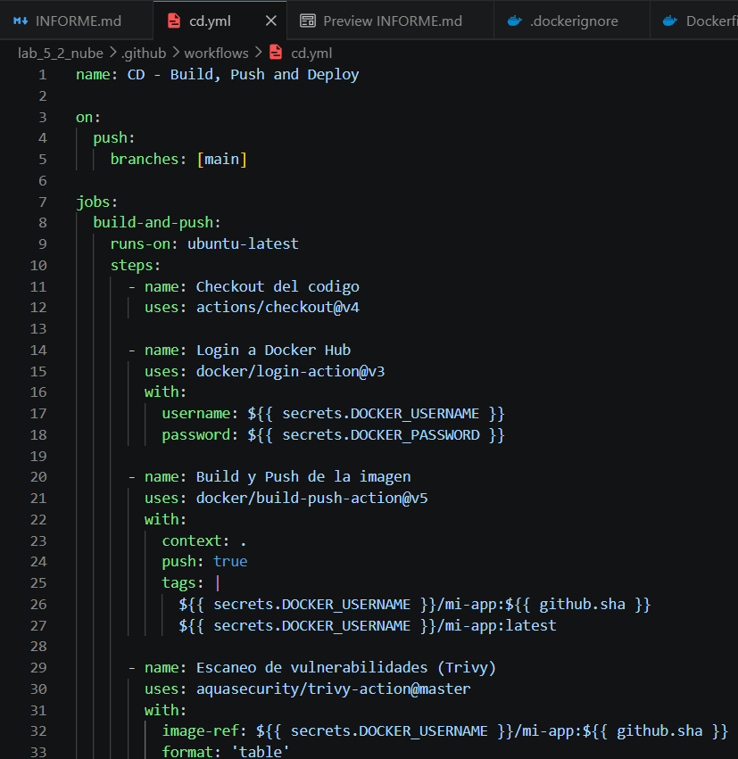

---

# 3.6 Explicación del Pipeline

El pipeline se divide en dos jobs:

## Build and Push

Este job realiza:

1. Descarga del código.
2. Login en Docker Hub.
3. Construcción de la imagen.
4. Publicación en Docker Hub.

## Deploy

Este job realiza:

1. Conexión SSH al servidor EC2.
2. Descarga de la nueva imagen.
3. Ejecución temporal del contenedor.
4. Validación mediante health check.
5. Reemplazo seguro del contenedor activo.
6. Limpieza de recursos Docker.

---

# 3.7 Verificación del Pipeline

Se verificó la correcta ejecución del pipeline desde la pestaña Actions de GitHub.

## Build and Push exitoso

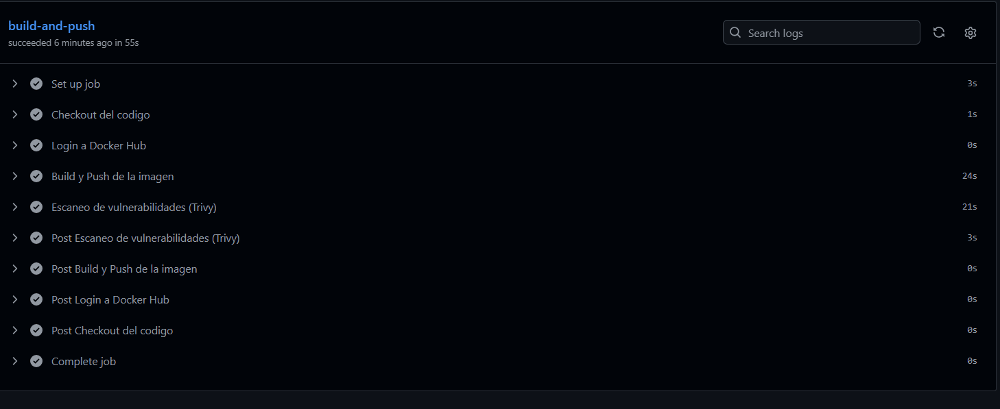

---

## Deploy exitoso

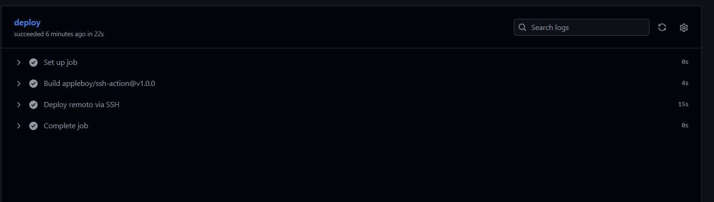

---

## Pipeline completo exitoso

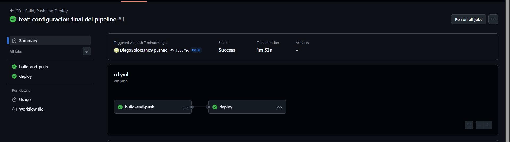

---

# 3.8 Verificación del despliegue en EC2

Se accedió mediante navegador a la IP pública de la instancia EC2.

## URL utilizada

```text
http://http://54.174.243.110/health
```

## Resultado obtenido

```json
{
  "status": "ok",
  "version": "1.0.0",
  "timestamp": "2026-05-13T21:17:26.990Z"
}
```

## Evidencia

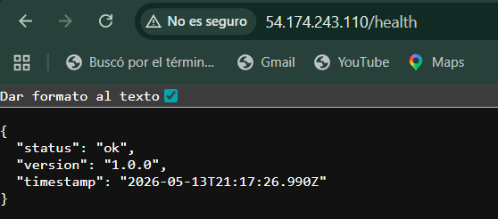

---

# 3.9 Actualización de la aplicación

Se modificó el endpoint `/health`.

## Código actualizado

```javascript
app.get('/health', (req, res) => {
    res.status(200).json({ 
        status: 'ok', 
        version: '1.0.0',
        timestamp: new Date().toISOString(),
        MessageEvent: 'Health check successful'
    });
});
```

## Resultado

El pipeline se ejecutó automáticamente y desplegó la nueva versión correctamente.

## Evidencia

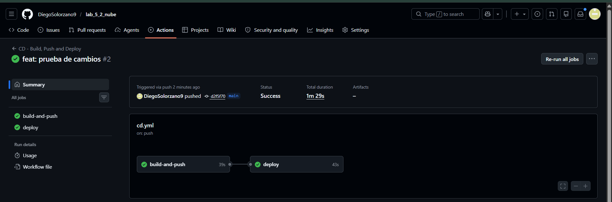
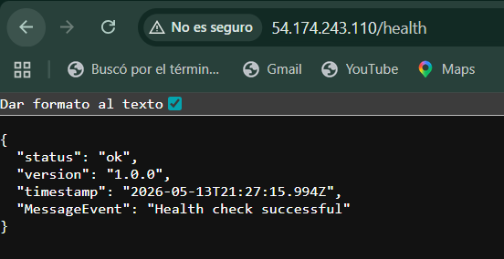


---

# 3.10 Simulación de fallo

Se simuló un error eliminando el endpoint `/health`.

## Resultado observado

- El health check falló.
- El pipeline marcó error.
- La versión anterior continuó funcionando.

## Importancia

Esto evita desplegar aplicaciones defectuosas en producción.

## Evidencia

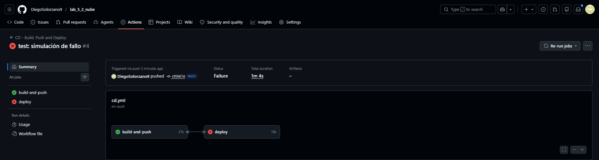
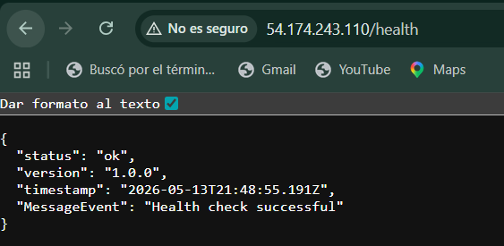

---

# 3.12 Escaneo de Vulnerabilidades

Se integró un escaneo de vulnerabilidades utilizando Trivy.

## Configuración

```yaml
- name: Escaneo de vulnerabilidades
  uses: aquasecurity/trivy-action@master
  with:
    image-ref: ${{ secrets.DOCKER_USERNAME }}/mi-app:${{ github.sha }}
    format: 'table'
    exit-code: '0'
    ignore-unfixed: true
    vuln-type: 'os,library'
    severity: 'CRITICAL,HIGH'
```

## Beneficios

- Identificación temprana de vulnerabilidades.
- Mejora de la seguridad.
- Prevención de despliegues inseguros.

## Evidencia

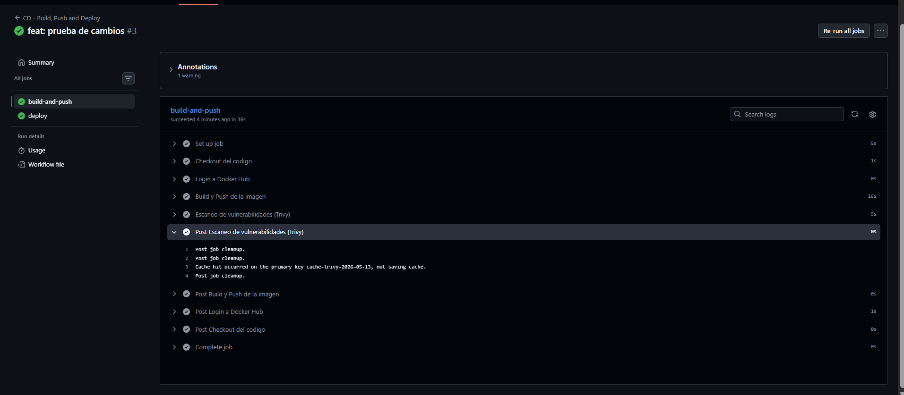

---

# 4. Ventajas del Uso de Docker y CI/CD

## Docker

- Portabilidad.
- Consistencia entre entornos.
- Facilidad de despliegue.
- Aislamiento de dependencias.

## CI/CD

- Automatización del despliegue.
- Reducción de errores manuales.
- Mayor velocidad de entrega.
- Integración continua de cambios.

---

# 5. Dificultades Encontradas

Durante el desarrollo del laboratorio se presentaron algunos inconvenientes:

- Configuración de secretos SSH.
- Problemas iniciales de permisos en Docker.
- Errores en el health check.
- Configuración del puerto expuesto.

Todos los problemas fueron solucionados mediante pruebas locales y revisión de logs.

---

# 6. Conclusiones

El laboratorio permitió comprender el funcionamiento completo de un pipeline de despliegue continuo moderno utilizando Docker y GitHub Actions.

Se logró automatizar completamente:

- La construcción de imágenes.
- El almacenamiento en Docker Hub.
- El despliegue remoto.
- La validación automática mediante health checks.

Además, se comprendió la importancia del rollback y del escaneo de vulnerabilidades para garantizar despliegues seguros y confiables.

Finalmente, el uso de contenedores y CI/CD representa una práctica fundamental en entornos DevOps modernos debido a su capacidad de automatizar procesos y mejorar la calidad del software.

---

# 7. Enlaces del Proyecto

## Repositorio GitHub

```text
https://github.com/DiegoSolorzano9/lab_5_2_nube.git
```

## URL pública de la aplicación

```text
http://54.174.243.110/health
```

---

# 8. Evidencias Requeridas

| Evidencia | Estado |
|---|---|
| Dockerfile multi-stage | ✅ |
| Build local | ✅ |
| Push a Docker Hub | ✅ |
| Workflow GitHub Actions | ✅ |
| Deploy automático | ✅ |
| Aplicación en EC2 | ✅ |
| Escaneo de vulnerabilidades | ✅ |
| Rollback documentado | ✅ |

---